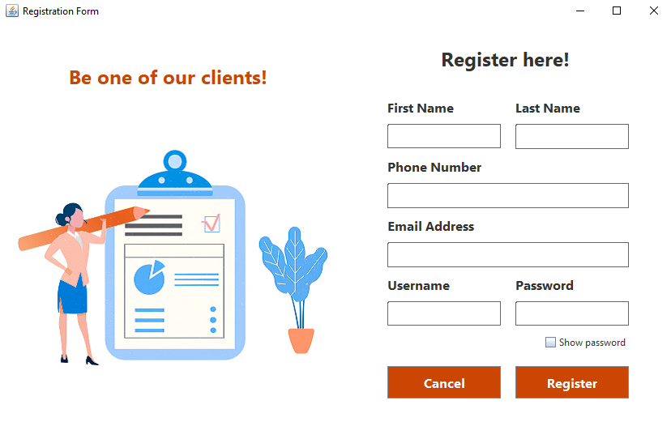
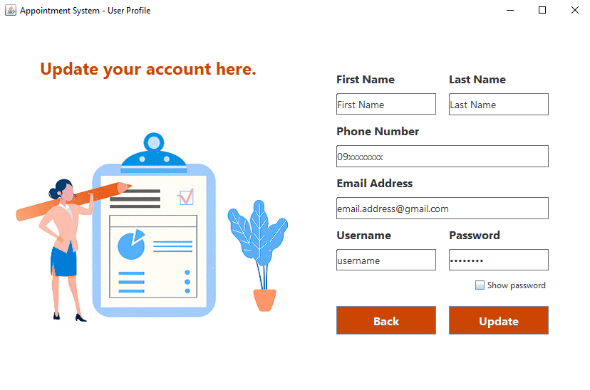
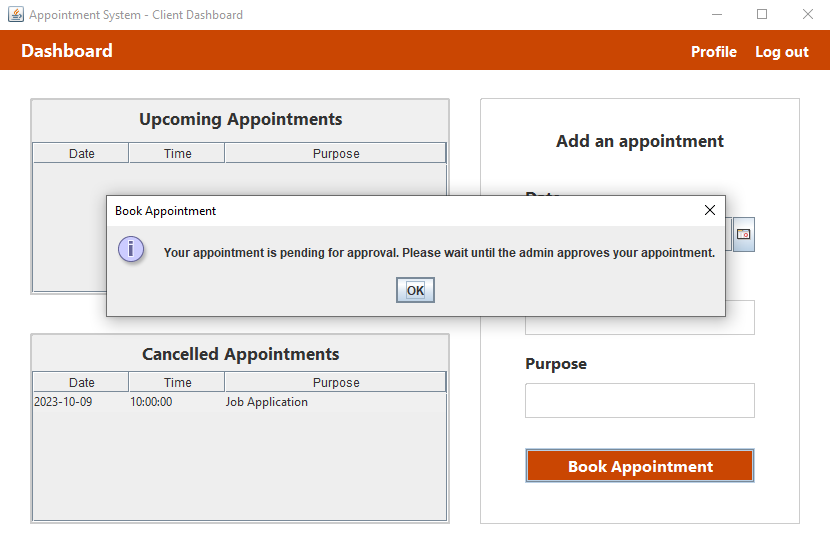
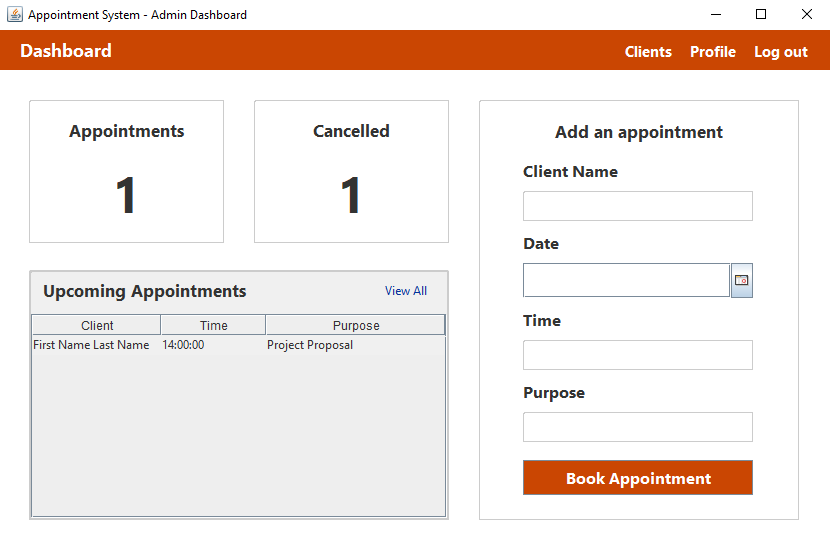

<h1>
    📁Appointment System
    
</h1>

📝 A simple appointment system designed to streamline the process of scheduling and managing appointments allows users to easily book appointments with businesses, professionals, or service providers. Users can choose their preferred date and time slots, and businesses/admins can choose to either approve or cancel the appointment. This efficient system enhances communication, reduces scheduling conflicts, and provides a convenient way for customers and businesses to keep track of their appointments, ensuring a smooth and organized appointment booking experience.

# 💻 Technologies

    
    
    
    
    
    
    

# 📖 Manual
- Install the project
    > - clone this repository https://github.com/rieza-ix/java-appointment-system

    or

    > - download the zip file and unzip the project to your desired location

- Run the project
    > navigate to 'App.java' file inside the 'src' folder and run the code

# ✨ Features
- The admin can register an account for the client, and the client itself can create its own account.

- Both admins and users can update their own account details.

- The user can book an appointment, but it is pending approval from the admin.
- The user can view their upcoming appointments or cancelled appointments.

- Admin can add, view, approve, or cancel an appointment.
